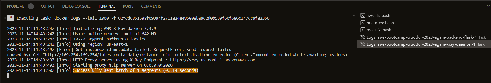

# Bug Fix: Invalid endpoint

## 1. Problem

* After updating the environment variables for the `backend-flask` container in the `docker-compose` file, I would keep running into this issue:&#x20;
  * `Invalid endpoint: https://logs..amazonaws.com`
* The most logical guess would be something is wrong with the AWS region configuration. The CloudWatch logs are sent over to AWS through thie CW service endpoint, which has the following structure:&#x20;
  * `logs.<YOUR_AWS_REGION>.amazonaws.com`
* I use `us-east-1` (N. Virginia) so it should be:&#x20;
  * `logs.us-east-1.amazonaws.com`

<div data-full-width="true">

<figure><figcaption></figcaption></figure>

</div>

## 2. Analysis & Solution

* [ ] Check your variables (if the values are set)
* [ ] Restart `docker-compose`
* [ ] Recreate your Gitpod workspace (if applicable)

I tried `echoing` all the variables I added to the env variables for the `backend` in `docker-compose`. It turns out, `AWS_DEFAULT_REGION` has no value set to it.

<figure><figcaption></figcaption></figure>

You can assign values to environmental variables in Linux as follows:

```bash
export AWS_DEFAULT_REGION="us-east-1"
gp env AWS_DEFAULT_REGION="us-east-1" # gitpod only
```

I restarted the `docker-compose`, however, this wouldn't fix the issue. In case you are using Gitpod, it is highly recommended that you create a brand new workspace, as this issue with updated env variables often happens with Gitpod workspaces. &#x20;

***

## 3. Result

After ticking all the boxes of the list suggested in the step 2. Analysis, the CloudWatch agent  correctly created a log group called `cruddur`.&#x20;

<figure><figcaption></figcaption></figure>

The CloudWatch agent is diligently working on our Cruddur backend and sending over http requests to AWS CloudWatch.

<figure><figcaption><p>A list of log streams coming through</p></figcaption></figure>

<figure><figcaption><p>Even logs showing a successful HTTP GET request handling</p></figcaption></figure>

## Resources

* AWS: [Amazon CloudWatch Logs endpoints and quotas](https://docs.aws.amazon.com/general/latest/gr/cwl\_region.html)
