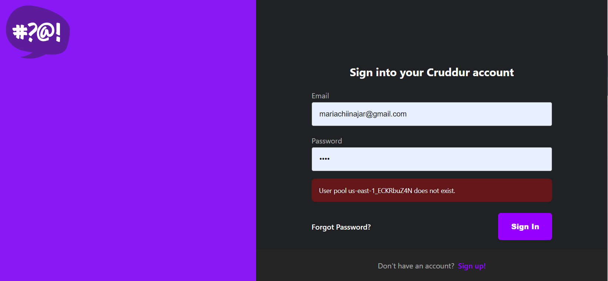

# 2.4.0 X-Ray Subsegments

## 0. **Learning Materials**

* Video: [Week 2 - X-Ray Subsegments Solved](https://www.youtube.com/watch?v=4SGTW0Db5y0\&list=PLBfufR7vyJJ7k25byhRXJldB5AiwgNnWv\&index=35\&ab\_channel=ExamPro)
* Andrew's repo: [week-2-xray-subsegments](https://github.com/omenking/aws-bootcamp-cruddur-2023/tree/week-2-xray-subsegments)
* My branch repo: [02-04-x-ray-subsegments-solved](https://github.com/mariachiinajar/aws-bootcamp-cruddur-2023-again/tree/02-04-x-ray-subsegments-solved)

### Task List

* [ ] a
* [ ] b
* [ ] c
* [ ] d

***

## 1. Workflow

placeholder

<figure><figcaption></figcaption></figure>

[**Pick up where you left off**](https://youtu.be/4SGTW0Db5y0?list=PLBfufR7vyJJ7k25byhRXJldB5AiwgNnWv\&t=1128)

<figure><figcaption></figcaption></figure>

