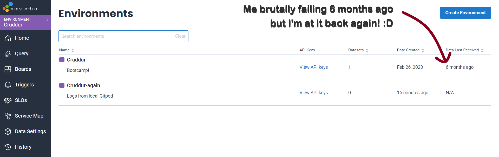

# Week 2 Distributed Tracing

## 0. **Learning Materials**

* Video: [FREE AWS Cloud Project Bootcamp (Week 2) - Distributed Tracing](https://www.youtube.com/watch?v=2GD9xCzRId4\&list=PLBfufR7vyJJ7k25byhRXJldB5AiwgNnWv\&index=28\&ab\_channel=ExamPro)
* Andrew's repo: [week-2](https://github.com/omenking/aws-bootcamp-cruddur-2023/tree/week-2)
* My branch repo: [02-00-distributed-tracing](https://github.com/mariachiinajar/aws-bootcamp-cruddur-2023-again/tree/02-00-distributed-tracing)

### Task List

* [ ] Honeycomb Console Setup
  * [ ] Create an account on HoneyComb
  * [ ] Create a tracing environment
* [ ] Honeycomb in Cruddur App
  * [ ] Configure `app.py` to send logs to HoneyComb
* [ ] Customise tracing
  * [ ] Add customised `span.attributes` and;
  * [ ] Test on HoneyComb console

### Env Variables

<table><thead><tr><th width="168">Micro service</th><th>Variables</th></tr></thead><tbody><tr><td>backend</td><td><ul><li><code>HONEYCOMB_API_KEY</code></li><li><code>OTEL_SERVICE_NAME</code></li><li><code>OTEL_EXPORTER_OTLP_ENDPOINT</code></li><li><code>OTEL_EXPORTER_OTLP_HEADERS</code></li></ul></td></tr></tbody></table>

***

## 1. Workflow

### HoneyComb Setup on Console

Create an Environment by clicking on the blue button at the right-top corner.&#x20;

<figure><figcaption></figcaption></figure>

* Navigate to your Environment's Settings then grab the API Keys.&#x20;

<figure><figcaption></figcaption></figure>

### Instrumenting Honeycomb in Cruddur App (Gitpod)&#x20;

We have to add the environmental variables to our backend Docker container. Add the following environment variable to `docker-compose.yml`.

* `OTEL_SERVICE_NAME`
* `OTEL_EXPORTER_OTLP_ENDPOINT`
* `OTEL_EXPORTER_OTLP_HEADERS`
  * Export `HONEYCOMB_API_KEY` in your local machine.


```yaml
services:
  backend-flask:
    environment:
      FRONTEND_URL: "https://3000-${GITPOD_WORKSPACE_ID}.${GITPOD_WORKSPACE_CLUSTER_HOST}"
      BACKEND_URL: "https://4567-${GITPOD_WORKSPACE_ID}.${GITPOD_WORKSPACE_CLUSTER_HOST}"
      OTEL_SERVICE_NAME: 'backend-flask'
      OTEL_EXPORTER_OTLP_ENDPOINT: "https://api.honeycomb.io"
      OTEL_EXPORTER_OTLP_HEADERS: "x-honeycomb-team=${HONEYCOMB_API_KEY}"
      ...
```


In order to set up HoneyComb, we need a few OpenTelemetry packages. Add the following Python libraries to `requirements.txt` (lines 4-8).


```
flask
flask-cors

opentelemetry-api 
opentelemetry-sdk 
opentelemetry-exporter-otlp-proto-http 
opentelemetry-instrumentation-flask 
opentelemetry-instrumentation-requests
```


Add the packages for HoneyComb to `app.py`


```python
from opentelemetry import trace
from opentelemetry.instrumentation.flask import FlaskInstrumentor
from opentelemetry.instrumentation.requests import RequestsInstrumentor
from opentelemetry.exporter.otlp.proto.http.trace_exporter import OTLPSpanExporter
from opentelemetry.sdk.trace import TracerProvider
from opentelemetry.sdk.trace.export import BatchSpanProcessor
```


Add the following lines to initialise tracing.


```python
provider = TracerProvider()
processor = BatchSpanProcessor(OTLPSpanExporter())
provider.add_span_processor(processor)
trace.set_tracer_provider(provider)
tracer = trace.get_tracer(__name__)
```


* Line 2: `OTLPSpanExporter` will send data to HoneyComb. It reads the env variables to configure where to send log data to.
* Now the initial setup and configuration is complete. Run `docker-compose` and hit some endpoints of your Cruddur app (fiddle around pages here and there, click around things that work, such as Home and Notification to generate some activities - namely, http requests).&#x20;

### Testing Tracing on HoneyComb

* Now, let's move to the HoneyComb console on the broswer. We want to check if the data is flowing smoothly from our Gitpod environment to HoneyComb.&#x20;
* If the HoneyComb is configured correctly in your Cruddur app, your HoneyComb environment should start seeing some data on the Console. The following image shows that my environment received a total of 9 traces.&#x20;

<figure><figcaption><p>Now trace data are coming through into my HoneyComb tracing environment.</p></figcaption></figure>

<figure><figcaption><p>Recen traces with span counts. </p></figcaption></figure>

### Create span data for tracing

Now that we confirmed that data are sent correctly to HoneyComb, we can start customising for more detailed observability.&#x20;

* Add the following lines to our flask app. I recommend comparing your code against the [repo file](https://github.com/mariachiinajar/aws-bootcamp-cruddur-2023-again/blob/02-00-distributed-tracing/backend-flask/app.py) to make sure you know where these lines sit.


```diff
+ from opentelemetry.sdk.trace.export import ConsoleSpanExporter, SimpleSpanProcessor                                           

provider = TracerProvider()
processor = BatchSpanProcessor(OTLPSpanExporter()) 
provider.add_span_processor(processor)

+ simple_processor = SimpleSpanProcessor(ConsoleSpanExporter()) 
+ provider.add_span_processor(simple_processor)                 

trace.set_tracer_provider(provider)
tracer = trace.get_tracer(__name__)
```


* **line 1**: import two exporters `ConsoleSpanExporter` and `SimpleSpanProcessor` from the package `OpenTelemetry`. These exporters export the span data generated by Cruddur.
* **line 3**: create a TracerProvider. This manages the overall telemetry pipeline.
* **line 4**: a `BatchSpanProcessor` exports spans using the OTLP (OpenTelemetry Protocol) format to an OTLP exporter.
* **line 5**: add the processor to the `TracerProvider`. Spans will be exported in OTLP format in batch.
* **lines 7-8**: a `SimpleSpanProcessor` exports spans to the console using the `ConsoleSpanExporter`.

Now, let's see if the data are going through.&#x20;

* Restart `docker-compose`.
* Then check the **logs** - either by clicking on the 'View the logs' button or running the command:
  * `docker logs --tail 1000 -f <YOUR_CONTAINER_ID>`

<div data-full-width="true">

<figure><figcaption></figcaption></figure>

</div>

In case you have multiple trace environments and you want to check which is which, our Week 2 guest instructor [Jessica Kerr](broken-reference) created an awesome [HoneyComb team identifier](https://honeycomb-whoami.glitch.me).

<figure><figcaption></figcaption></figure>

### Customising traces

Using the `set_attribute` function of the `span` class, we can add and send our custom data to HoneyComb. Add the following lines to the HomActivities service (`backend-flask/servicse/home_activities.py`).

* **line 2**: import `trace` from the `opentelemetry` library.
* **line 4**: create a `tracer` object.&#x20;
* **line 8**: using the `tracer` from line 4, wrap the data `results` so we send them over to our HoneyComb tracing environment.
* **line 13**: Make sure to indent this line correctly so the span attribute `app.result_length` belongs to the statement block `with tracer.start_as_current_span`. Python is really sensitive to indentation.


```diff
from datetime import datetime, timedelta, timezone
+ from opentelemetry import trace

+ tracer = trace.get_tracer("home.activities")

class HomeActivities:
  def run():
+    with tracer.start_as_current_span("home-activities-mock-data"):
+      span = trace.get_current_span()
+      now = datetime.now(timezone.utc).astimezone()
+      span.set_attribute("app.now", str(now))
      results = [{ ... }]
+      span.set_attribute("app.result_length", len.(results))
    return results
```


* Restart the docker compose, then&#x20;
* Hit the backend endpoint for `HomeActivities`
  * URL: `https://4567-${GITPOD_WORKSPACE_ID}.${GITPOD_WORKSPACE_CLUSTER_HOST/api/activites/home`&#x20;
* Now, check on the HoneyComb console if the span has come through.

<div data-full-width="true">

<figure><figcaption><p>app.now came through. </p></figcaption></figure>

</div>

<div data-full-width="true">

<figure><figcaption><p>app.now data came through (line 11)</p></figcaption></figure>

</div>

<div data-full-width="true">

<figure><figcaption><p>app.result_length data came through (line 13)</p></figcaption></figure>

</div>

Now that our tracing data are accumulated, we can start extracting more insights from these data. **Observability tools** offer various data processing metrics and features. In the image below, for instance, [Jessica](broken-reference) walked us through the Heatmap feature.

* **Heatmap** is useful for visualising data to highlight the concentration or density of data points (typically using colour).&#x20;

<div data-full-width="true">

<figure><figcaption></figcaption></figure>

</div>

### + Configuring Gitpod

This is not relevant to the HoneyComb setup, configuration and tracing testing. However, it helps ensure the port configuration for our Gitpod environment. [Andrew](https://www.linkedin.com/in/andrew-wc-brown/) decides to add the ports as [the other Andrew](https://www.linkedin.com/in/abayko/) whispers that [the first Andrew](https://www.linkedin.com/in/andrew-wc-brown/) really needs to do it lol.

* Add the ports in `gitpod.yml`.

```yaml
ports:
  - name: frontend
    port: 3000
    onOpen: open-browser
    visibility: public
  - name: backend
    port: 4567
    visibility: public
  - name: xray-daemon
    port: 2000
    visibility: public
```

***

## 2. Discussion&#x20;

### Docker

We must always use different **base images** for development and production for the following reasons:&#x20;

* **Dev version**: during development, we need a lot of dev assistance tools and dependencies such as logging, hot reloading and all that jazz.&#x20;
* **Prod version**: on the other hand, we want a super slim verbsion of base image without all the tools you used in development. It is more secure and faster to have as little dependencies installed as possible.&#x20;

